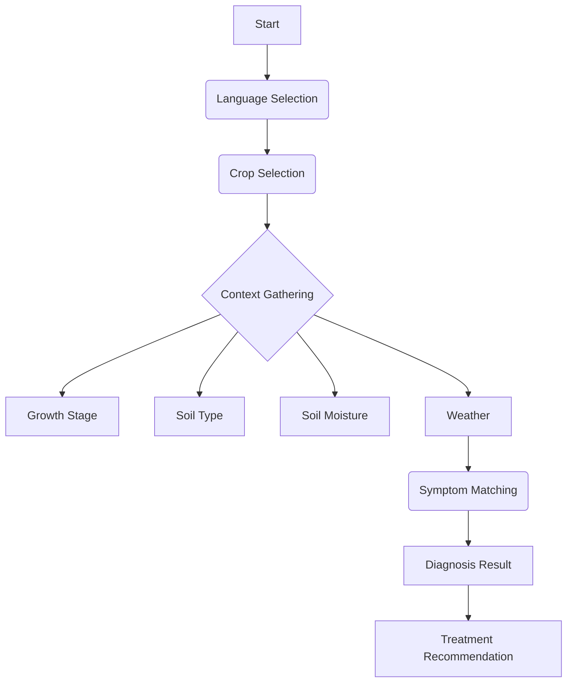

# AgroTech: Crop Advisory for Low-Internet Farmers

> **Offline-First. Multilingual. Accessible.**
> *Empowering farmers with instant crop diagnosis and advisory, regardless of connectivity.*

---

## 📖 Introduction
**AgroTech** is a Progressive Web Application (PWA) designed to bridge the digital divide in agriculture. Millions of farmers in remote areas struggle with limited internet access and language barriers, making it difficult to get timely advice for crop diseases.

This application solves that problem by providing a **completely offline-capable**, **voice-assisted**, and **visually intuitive** diagnosis tool. It guides farmers through a simple 8-step process to identify crop issues and recommends immediate treatments—all without sending data to a server.

## 🚀 Key Features

### 1. 📶 **Offline-First Architecture**
- Built as a PWA using `vite-plugin-pwa`.
- All critical assets (images, fonts, logic) are cached locally.
- Functionality persists even when the device is in "Airplane Mode."

### 2. 🗣️ **Multilingual & Voice Support**
- Full support for **English** and **Hindi** (easily extensible).
- **Text-to-Speech (TTS)** integration reads out instructions for valid accessibilty, helping farmers with low literacy rates.

### 3. 🖼️ **Visual Diagnosis System**
- High-fidelity visual cards for symptoms (Rice, Wheat, Sugarcane, Maize).
- Farmers select what they *see* rather than typing descriptions.
- **Smart Asset Management**: Uses optimized PNGs for common crops and lightweight SVG fallbacks for others to minimize app size.

### 4. 🧠 **Logic-Based Expert System**
- Deterministic finite-state machine logic ensures accurate diagnoses.
- Factors in **Crop Type**, **Growth Stage**, **Soil Type**, **Moisture**, and **Weather** to filter potential diseases.

---

## 🛠️ Technology Stack

We chose a lightweight, modern stack to ensure performance on low-end devices.

- **Frontend Framework**: [React 19](https://react.dev/)
- **Build Tool**: [Vite](https://vitejs.dev/) (Rolldown)
- **PWA Engine**: [Vite PWA Plugin](https://vite-pwa-org.netlify.app/)
- **Styling**: Vanilla CSS with **Glassmorphism** design system (Premium UI/UX).
- **Icons**: [Lucide React](https://lucide.dev/)
- **Internationalization**: [i18next](https://www.i18next.com/)
- **State Management**: React Context API & Local Hooks.

---

## 🏗️ Architecture & Workflow

The application follows a linear, guided workflow designed to minimize user error.



### Technical Workflow
1.  **Initialization**: App loads and registers the Service Worker immediately.
2.  **Asset Caching**: `workbox` strategy caches all static assets (`/assets`) and translation files (`/locales`).
3.  **User Input**: User selections are stored in a temporary React state (no database required for this session).
4.  **Logic Engine**:
    *   `SymptomSelection.jsx` filters symptoms based on the selected `Crop` and `GrowthStage`.
    *   `DiagnosisResult.jsx` maps the selected symptom ID to a specific disease profile and treatment plan.
5.  **Output**: The final result provides actionable steps (Spray, Prune, Water) with visual icons.

---

## 📱 User Experience (UX) Decisions

*   **Large Touch Targets**: Action buttons are standardized to **72px height** for easy tapping on small screens.
*   **High Contrast & Visuals**: Critical information is conveyed through color (Red/Green/Blue zones) and imagery, not just text.
*   **Audio Feedback**: Every critical step has an optional "Read Aloud" button.
*   **Glassmorphism**: Provides a modern, "premium" feel that builds trust, distinguishing it from typical utilitarian government apps.

---

## 🔮 Future Roadmap

*   **Image Upload**: Add TensorFlow.js for on-device ML verification of leaf photos.
*   **Community Board**: Peer-to-peer sharing via local Bluetooth/Wifi-Direct.
*   **Weather API Integration**: Sync local logic with real-time weather data when internet *is* available.

---

## 🏃‍♂️ How to Run

1.  **Clone the repository**:
    ```bash
    git clone https://github.com/your-username/agrotech-pwa.git
    ```
2.  **Install Dependencies**:
    ```bash
    npm install
    ```
3.  **Run Development Server**:
    ```bash
    npm run dev
    ```
4.  **Build for Production**:
    ```bash
    npm run build
    npx vite preview
    ```

---

> *Built with ❤️ by the AgroTech Team for the Global Hackathon.*